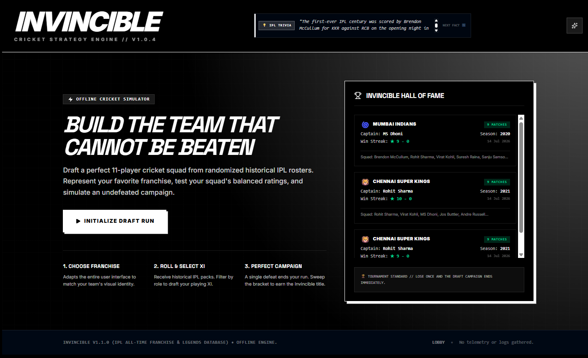
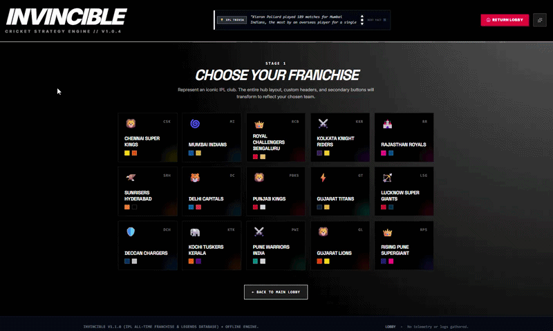
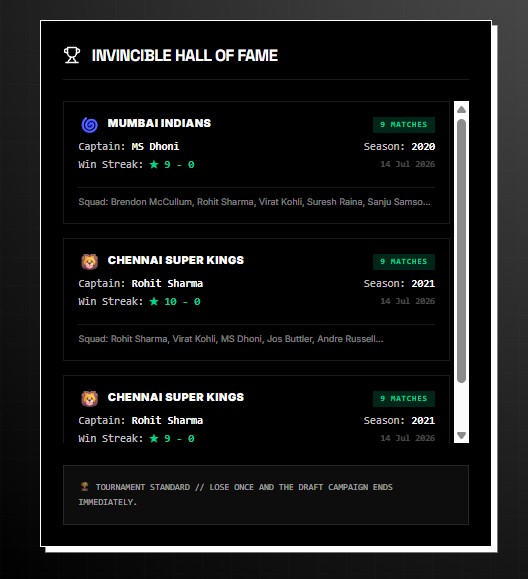
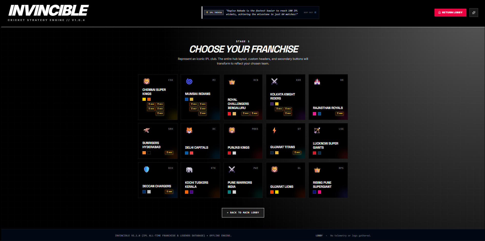
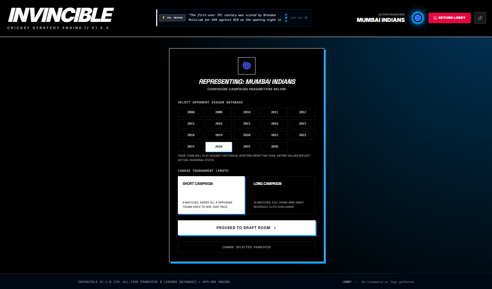
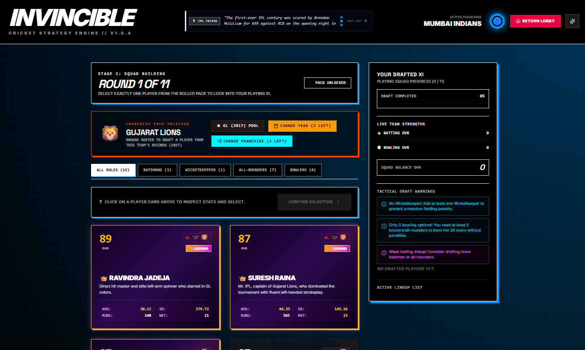
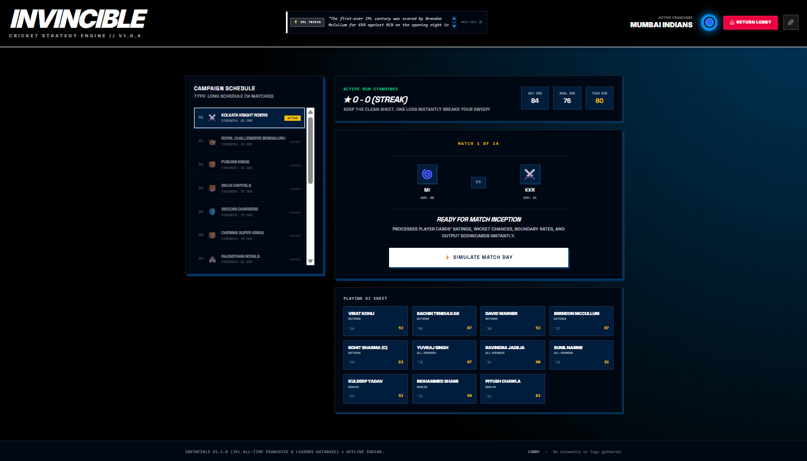
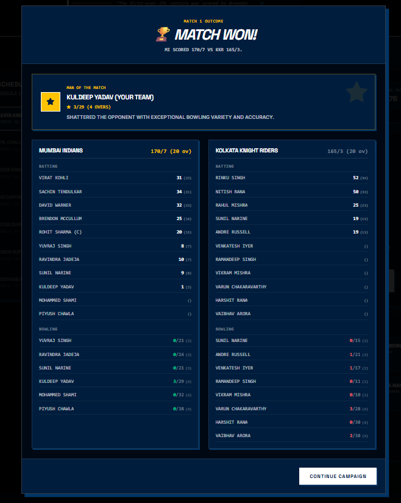
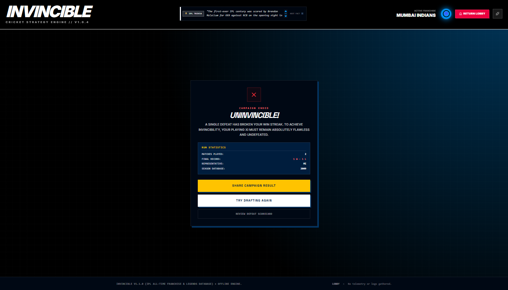

<p align="center">
  
</p>

<h1 align="center">🏏 Invincible – IPL Strategy Simulator</h1>

<p align="center">
A premium browser-based cricket strategy game where you draft legendary IPL players, build your dream Playing XI, and attempt to complete an undefeated championship campaign against historical IPL franchises.
</p>

<p align="center">


</p>

---

# 🏏 About The Project

**Invincible** is a browser-based IPL strategy simulator inspired by sports management games. Instead of controlling players directly, the objective is to build the strongest possible Playing XI using randomized historical IPL player packs and guide your team through an entire undefeated tournament campaign.

Every decision matters. Selecting the right combination of batters, bowlers, wicketkeepers, and all-rounders directly impacts your team's strength, tactical balance, and match outcomes. One defeat immediately ends your championship run, making every draft decision and simulated match critically important.

The project combines strategic drafting, historical IPL statistics, real-time squad analysis, detailed scorecards, persistent championship history, and a premium gaming-inspired user interface into a complete browser experience.

---

# ✨ Features

- 🏏 Draft legendary IPL players from randomized franchise packs
- 🎯 Build a balanced Playing XI using strategic team composition
- 📅 Historical IPL databases covering multiple seasons
- 🏆 Short and Long tournament campaign modes
- ⚡ Complete cricket match simulation engine
- 📊 Detailed batting and bowling scorecards
- 👑 Man of the Match awards
- 📈 Live Batting, Bowling and Team Overall ratings
- 🎨 Dynamic franchise themes that completely transform the interface
- 🏆 Persistent Hall of Fame for championship-winning teams
- 📖 Live IPL trivia displayed throughout gameplay
- 💾 Automatic campaign progress saving
- 📱 Fully responsive interface
- 🎮 Premium AAA-inspired sports game UI

---

# 🛠 Tech Stack

### Frontend

- React
- TypeScript
- Vite

### Styling

- CSS3
- Responsive Layout
- Custom Theme Engine

### Game Engine

- Custom Cricket Match Simulation
- Historical IPL Player Database
- Dynamic Team Rating System
- Draft & Campaign Logic

---

# 🎮 Gameplay

The gameplay is divided into multiple stages.

1. Choose your IPL franchise.
2. Select a historical IPL season.
3. Configure campaign length.
4. Draft your Playing XI from randomized franchise packs.
5. Balance batting, bowling, wicketkeepers and all-rounders.
6. Simulate every match using the custom cricket engine.
7. Win every game to become **Invincible**.
8. Enter the Hall of Fame and create your cricket legacy.

---

# 📸 Screenshots & Gameplay Walkthrough

Follow the complete journey from creating a franchise to building an undefeated championship squad.

---

## 🏠 Main Lobby

The central hub where every campaign begins. Players can initialize a new draft run, browse IPL trivia, and review previous championship victories through the Hall of Fame.


---

## 🌈 Dynamic Franchise Themes

Every IPL franchise features its own unique visual identity. Selecting a different team instantly updates the application's colors, gradients, glow effects, headers, and interface styling to create a personalized experience.



---

## 🏆 Hall of Fame

Every undefeated championship is permanently recorded. Winning teams, captains, squad members, seasons, campaign dates, and win streaks are preserved, allowing players to build a lasting cricket legacy across multiple playthroughs.



---

## 🏏 Franchise Selection

Choose from both current and historic IPL franchises before beginning your campaign. Every franchise includes custom branding and personalized interface styling.



---

## ⚙ Campaign Configuration

Select the historical IPL season database and choose between a short or long tournament campaign before entering the draft room.



---

## 🎯 Strategic Draft Room

Draft legendary IPL players from randomized franchise packs while monitoring batting strength, bowling strength, squad balance, tactical warnings, and Playing XI progress in real time.



---

## 📅 Campaign Dashboard

Manage your undefeated campaign by viewing fixtures, squad ratings, active Playing XI, tournament progress, and simulate every match using the integrated cricket engine.



---

## 📊 Match Scorecards

Each simulated match generates a complete professional scorecard including batting performances, bowling figures, innings summaries, match statistics, final results, and the Man of the Match.



---

## 💀 Campaign Complete

One defeat immediately ends the campaign. Review your complete tournament statistics, overall record, selected franchise, historical season, and decide whether to begin another attempt.



---

# 📂 Project Structure

```
Invincible-IPL-Simulator
│
├── screenshots/
├── src/
├── assets/
├── public/
├── package.json
├── vite.config.ts
├── tsconfig.json
├── README.md
└── LICENSE
```

---

# 🚀 Installation

Clone the repository

```bash
git clone https://github.com/Loledproski/invincible-ipl-simulator.git
```

Navigate into the project

```bash
cd invincible-ipl-simulator
```

Install dependencies

```bash
npm install
```

Run the development server

```bash
npm run dev
```

Build for production

```bash
npm run build
```

---

# 🎯 Future Improvements

- Online multiplayer drafting
- Player trading system
- Auction mode
- Franchise career mode
- Difficulty levels
- Dynamic commentary engine
- Player injuries and fitness
- Achievement & trophy system
- Steam-inspired statistics dashboard
- Cloud save synchronization

---

# 📄 License

This project is licensed under the MIT License.

---

# 👨‍💻 Developer

**Harsh Mishra**

If you enjoyed this project, consider ⭐ starring the repository to support future development.
