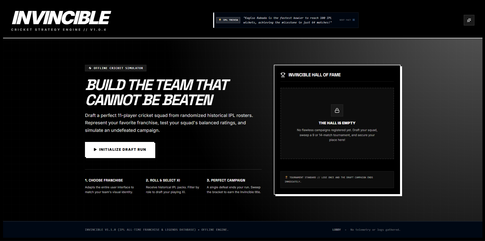
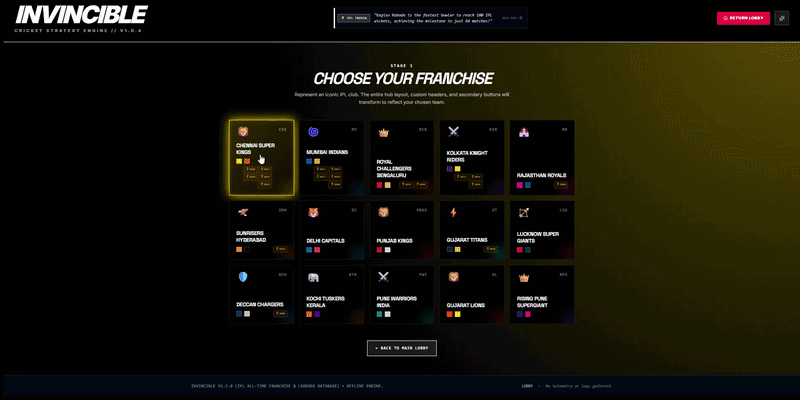
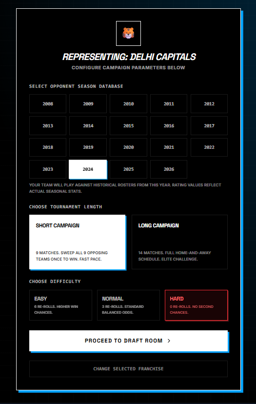
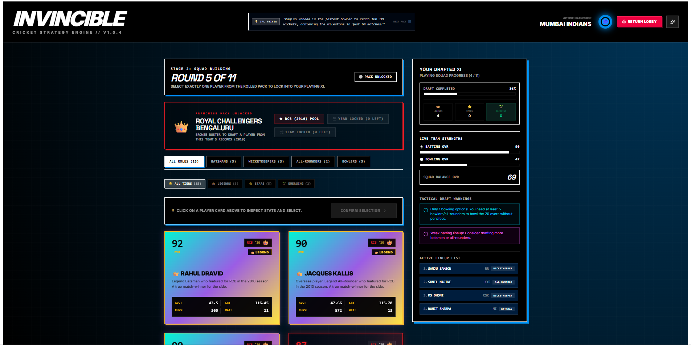
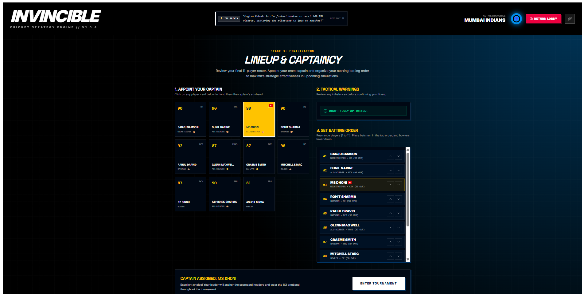
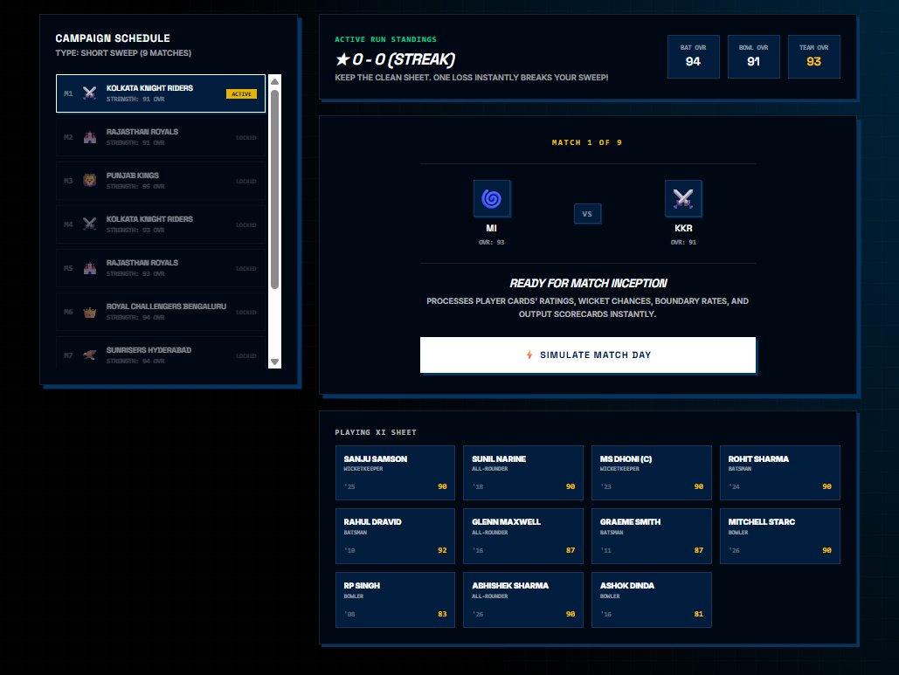
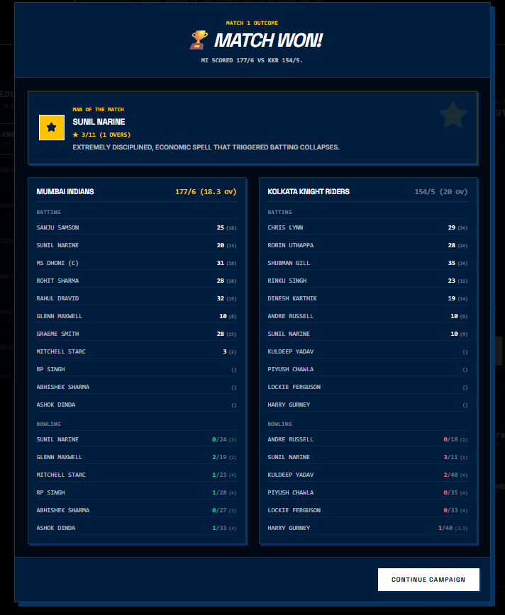
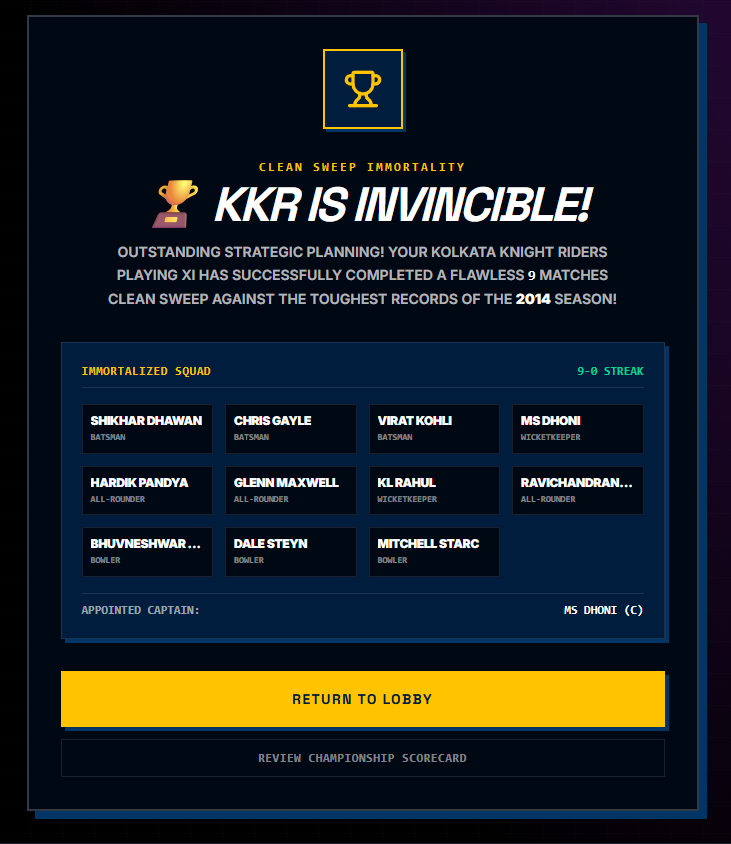
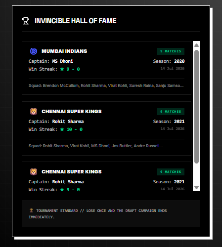

# 🏏 INVINCIBLE — IPL Cricket Strategy Simulator

<p align="center">
  <strong>BUILD THE TEAM THAT CANNOT BE BEATEN.</strong>
</p>

<p align="center">
  Draft your ultimate Playing XI from historical IPL rosters, represent your favorite franchise, build a balanced squad, appoint your captain, set your batting order, and attempt to complete an undefeated campaign.
</p>

<p align="center">
  <a href="https://invincible-ipl-simulator.vercel.app/"><strong>🎮 PLAY LIVE</strong></a>
  &nbsp;&nbsp;•&nbsp;&nbsp;
  <a href="https://invincible.ai.studio"><strong>✨ AI STUDIO APP</strong></a>
  &nbsp;&nbsp;•&nbsp;&nbsp;
  <a href="https://github.com/Loledproski/invincible-ipl-simulator"><strong>💻 SOURCE CODE</strong></a>
</p>

---

## ⚡ About INVINCIBLE

**INVINCIBLE** is an interactive IPL cricket strategy and squad-building simulator built around one simple challenge:

> **Can you build a Playing XI that cannot be beaten?**

The game allows you to represent an IPL franchise and build your dream **11-player squad** by drafting players from randomized historical IPL franchise rosters.

But assembling a team of superstars is only the beginning.

Your squad must maintain the right balance between batting, bowling, wicketkeeping, and all-round ability. Once your Playing XI is complete, you appoint your captain, organize your batting order, and enter a simulated IPL campaign.

Your objective is simple — **win every match**.

A single defeat ends the dream of becoming **INVINCIBLE**.

Complete the entire tournament without losing and your legendary squad earns its place in the **INVINCIBLE Hall of Fame**.

---

# 🎮 Play the Game

### 🌐 Live Web Version

👉 **https://invincible-ipl-simulator.vercel.app/**

The latest public deployment of INVINCIBLE is hosted on Vercel.

### ✨ AI Studio Version

👉 **https://invincible.ai.studio**

The application is also available through its AI Studio deployment.

### 💻 GitHub Repository

👉 **https://github.com/Loledproski/invincible-ipl-simulator**

Explore the source code, contribute to the project, report issues, or follow future development.

---

# 📸 Game Preview

## 🏠 Main Lobby — Build the Team That Cannot Be Beaten

The INVINCIBLE lobby introduces the core challenge of the game.

Start a new draft run and attempt to construct a perfectly balanced Playing XI capable of surviving an entire undefeated campaign.

The lobby also contains the **INVINCIBLE Hall of Fame**, where successful flawless campaigns are preserved.



---

## 🏏 Choose Your Franchise

Begin your journey by choosing the franchise you want to represent.

INVINCIBLE includes both modern and historical IPL franchises, allowing players to experience teams from across different eras of the tournament.


Available franchises include:

- Chennai Super Kings
- Mumbai Indians
- Royal Challengers Bengaluru
- Kolkata Knight Riders
- Rajasthan Royals
- Sunrisers Hyderabad
- Delhi Capitals
- Punjab Kings
- Gujarat Titans
- Lucknow Super Giants
- Deccan Chargers
- Kochi Tuskers Kerala
- Pune Warriors India
- Gujarat Lions
- Rising Pune Supergiant

Historical championship indicators are displayed for relevant franchises, celebrating their successful IPL seasons.

---

## 🎨 Dynamic Franchise Themes

Your franchise selection changes more than just your team name.

INVINCIBLE features a **dynamic franchise theme system** that adapts parts of the game's visual identity based on the franchise you choose.

Colors, highlights, backgrounds, and interface accents transform to create a unique experience for each team.



This allows every campaign to visually represent the identity of the selected franchise.

---

# ⚙️ Configure Your Campaign

After selecting a franchise, configure the challenge you want to face.



## 📅 Historical Season Database

Choose an IPL season database from:

**2008 → 2026**

The selected season determines the historical opponent rosters your squad will face during the tournament.

Player ratings and roster compositions are designed around their respective seasonal context.

---

## 🏆 Tournament Length

Choose between two campaign formats.

### ⚡ Short Campaign

**9 Matches**

Face opposing teams in a fast-paced campaign.

Sweep the tournament without losing to become INVINCIBLE.

### 🔥 Long Campaign

**14 Matches**

A longer and more demanding tournament experience designed for players looking for a greater challenge.

---

# 🎯 Difficulty System

INVINCIBLE includes multiple difficulty modes that directly affect the drafting experience.

### 🟢 Easy

More opportunities to reroll draft options, giving you greater flexibility while constructing your squad.

### ⚪ Normal

The standard INVINCIBLE experience with balanced drafting opportunities.

### 🔴 Hard

A much more unforgiving challenge with limited rerolls and fewer opportunities to correct draft decisions.

Every decision matters.

Build carefully.

---

# 🎲 Historical Player Draft System

The heart of INVINCIBLE is its randomized historical player drafting system.

Each round presents players drawn from historical IPL franchise rosters.

Your objective is to construct the strongest and most balanced **Playing XI** possible.



The draft interface provides information including:

- Player Overall Rating (OVR)
- Historical Franchise
- Season
- Player Role
- Batting Statistics
- Bowling Statistics
- Player Tier
- Squad Progress
- Batting OVR
- Bowling OVR
- Squad Balance OVR

You must draft exactly **11 players** before entering the tournament.

---

# 👑 Player Tier System

Players are classified into different tiers based on their ratings and historical impact.

The draft system visually distinguishes these tiers to make elite players immediately recognizable.

### 👑 Legends

The elite players of IPL history.

Legend cards represent some of the strongest players available in the database and feature distinctive premium visual styling.

### ⭐ Stars

High-level players capable of becoming key members of your squad.

### 🌱 Emerging Players

Developing players who can provide depth and strategic options during the draft.

The challenge is not simply collecting the highest-rated players.

A truly INVINCIBLE team requires **balance**.

---

# 🔎 Role-Based Draft Filtering

During the draft, players can be filtered by role.

Available filters include:

- All Roles
- Batsmen
- Wicketkeepers
- All-Rounders
- Bowlers

Tier-based filters also help you quickly identify different categories of players.

This makes it easier to analyze the available draft pack and build your squad strategically.

---

# ⚠️ Tactical Draft Warnings

INVINCIBLE continuously analyzes your developing squad during the draft.

The tactical warning system identifies potential weaknesses before your Playing XI is finalized.

Warnings may include:

- Missing wicketkeeper
- Insufficient bowling options
- Weak batting lineup
- Poor squad balance

The system encourages strategic squad construction instead of simply selecting players based on overall ratings.

Your **Batting OVR**, **Bowling OVR**, and **Squad Balance OVR** update as your team develops.

---

# 👨‍✈️ Lineup & Captaincy

Once your 11-player squad is complete, you enter the final preparation stage.



Before entering the tournament, you can:

- Review your complete Playing XI
- Appoint your team captain
- Review tactical warnings
- Organize your batting order
- Evaluate player roles
- Confirm your final lineup

The captain receives the **(C)** designation throughout the tournament and appears on match scorecards.

Once your tactical setup is complete, your squad is ready to enter the campaign.

---

# 📊 Campaign Schedule

Your campaign dashboard tracks the entire tournament.



The campaign interface displays:

- Current Win Streak
- Match Number
- Campaign Schedule
- Upcoming Opponents
- Opponent Strength
- Batting OVR
- Bowling OVR
- Team OVR
- Complete Playing XI

Every match represents another step toward immortality.

But remember:

> **One loss ends the campaign immediately.**

---

# 🏏 Match Simulation Engine

INVINCIBLE features a custom cricket match simulation system that processes multiple factors when determining match outcomes.

The simulation considers elements such as:

- Player ratings
- Team strength
- Batting strength
- Bowling strength
- Player roles
- Match conditions
- Performance probabilities

Each match produces a detailed scorecard showing how the game unfolded.

---

# 📋 Detailed Match Scorecards

After every simulated match, INVINCIBLE generates a full match result screen.



Scorecards display:

- Match Result
- Team Scores
- Overs
- Individual Batting Performances
- Bowling Figures
- Wickets
- Man of the Match
- Match Summary

If your squad wins, the campaign continues.

If your squad loses, the pursuit of invincibility ends.

---

# 🏆 The INVINCIBLE Challenge

The ultimate objective is to complete an entire campaign without losing a single match.

Win every match and your team achieves:

## 🏆 CLEAN SWEEP IMMORTALITY

Your franchise is officially declared:

# **INVINCIBLE**



The championship screen records your immortalized squad, undefeated streak, selected franchise, and appointed captain.

Only flawless campaigns earn this achievement.

---

# 🏛️ INVINCIBLE Hall of Fame

Every successful undefeated campaign is preserved in the **INVINCIBLE Hall of Fame**.



Hall of Fame entries can include:

- Franchise
- Captain
- Season
- Undefeated Win Streak
- Campaign Length
- Winning Squad
- Completion Date

This creates a personal history of your greatest INVINCIBLE squads.

Build different teams.

Represent different franchises.

Conquer different IPL eras.

Create your own collection of undefeated champions.

---

# 🧠 IPL Trivia System

Throughout the game, players can discover IPL trivia and historical facts displayed within the interface.

The trivia system adds an additional layer of cricket history to the experience while players draft teams and progress through campaigns.

---

# ✨ Core Features

- 🏏 Interactive IPL Cricket Strategy Simulator
- 🎲 Randomized Historical Player Drafting
- 👥 11-Player Playing XI Construction
- 📅 IPL Season Databases from 2008–2026
- 🏆 Current and Historical IPL Franchises
- 🎨 Dynamic Franchise-Specific Themes
- 🏅 Historical Championship Indicators
- 👑 Legend Player Tier System
- ⭐ Star Player Tier
- 🌱 Emerging Player Tier
- 🔎 Role-Based Player Filtering
- 🎯 Tier-Based Player Filtering
- ⚡ Player OVR Ratings
- 📊 Batting OVR System
- 🎳 Bowling OVR System
- ⚖️ Squad Balance OVR
- ⚠️ Tactical Draft Warnings
- 🔄 Draft Reroll Mechanics
- 🎚️ Easy, Normal, and Hard Difficulty Modes
- 👨‍✈️ Captain Selection
- 📋 Custom Batting Order
- ⚡ 9-Match Short Campaign
- 🔥 14-Match Long Campaign
- 🗓️ Interactive Campaign Schedule
- 🏏 Cricket Match Simulation Engine
- 📊 Detailed Match Scorecards
- ⭐ Man of the Match System
- 💀 Sudden-Elimination Campaign Rules
- 🏆 INVINCIBLE Championship Victory
- 🏛️ Persistent Hall of Fame
- 🧠 IPL Trivia System
- 📱 Responsive Web Interface
- ⚡ Fast Vite-Powered Frontend

---

# 🛠️ Tech Stack

INVINCIBLE is primarily built using modern web technologies.

### Frontend

- **React**
- **TypeScript**
- **Vite**
- **Tailwind CSS**

### UI & Animation

- **Lucide React**
- **Motion**

### Development

- **Node.js**
- **npm**
- **Visual Studio Code**
- **Git**
- **GitHub**

### AI-Assisted Development

Parts of the development workflow were created and refined with the assistance of **Google AI Studio** and AI-assisted development tools.

AI assistance was used as part of the development process while the game's systems, interface, player database, simulation mechanics, balancing logic, and overall product direction were iteratively designed and customized for the project.

### Deployment

- **Vercel** — Public web deployment
- **Google AI Studio** — AI Studio application version
- **GitHub** — Source code and version control

---

# 📂 Project Structure

```text
invincible-ipl-simulator/
│
├── assets/
│   └── aistudio/
│
├── screenshots/
│   ├── invincible-homepage.png
│   ├── campaign-setup-and-difficulty.png
│   ├── invincible-hall-of-fame.png
│   ├── match-result-scorecard.png
│   ├── campaign-schedule.png
│   ├── lineup-and-captaincy.png
│   ├── player-draft-system.png
│   ├── franchise-selection.png
│   ├── dynamic-franchise-themes.gif
│   └── invincible-championship-victory.png
│
├── src/
│
├── .env.example
├── .gitignore
├── LICENSE
├── README.md
├── index.html
├── metadata.json
├── package.json
├── tsconfig.json
└── vite.config.ts
```

The exact internal structure may evolve as development continues.

---

# 🚀 Getting Started

Follow these steps to run INVINCIBLE locally.

## 1. Clone the Repository

```bash
git clone https://github.com/Loledproski/invincible-ipl-simulator.git
```

## 2. Enter the Project Directory

```bash
cd invincible-ipl-simulator
```

## 3. Install Dependencies

Make sure **Node.js** and **npm** are installed on your computer.

Then run:

```bash
npm install
```

## 4. Configure Environment Variables

If required by your version of the project, create a `.env` file based on the provided `.env.example`.

```bash
cp .env.example .env
```

On Windows, you can manually create a `.env` file and copy the required variable names from `.env.example`.

> ⚠️ Never commit real API keys, credentials, or secrets to GitHub.

## 5. Start the Development Server

```bash
npm run dev
```

Vite will display the local development address in your terminal.

Open that address in your browser to run INVINCIBLE locally.

---

# 📦 Build for Production

To create a production build:

```bash
npm run build
```

The optimized production files will be generated in the build output directory configured by Vite.

To preview the production build locally:

```bash
npm run preview
```

---

# 🔐 Environment Variables & Security

Sensitive information such as API keys should never be committed directly to the repository.

Use environment variables for secrets and provide only placeholder values inside `.env.example`.

Example:

```env
GEMINI_API_KEY=your_api_key_here
```

Your real `.env` file should remain excluded through `.gitignore`.

If you discover a security vulnerability, please follow the instructions provided in the repository's `SECURITY.md` file instead of publicly disclosing sensitive vulnerability details.

---

# 🤝 Contributing

Contributions, improvements, bug fixes, and feature suggestions are welcome.

If you would like to contribute:

1. Fork the repository.
2. Create a new branch:

```bash
git checkout -b feature/your-feature-name
```

3. Make your changes.
4. Commit your changes:

```bash
git commit -m "feat: add your feature description"
```

5. Push your branch:

```bash
git push origin feature/your-feature-name
```

6. Open a Pull Request.

Please read `CONTRIBUTING.md` before submitting major changes.

All contributors are expected to follow the project's `CODE_OF_CONDUCT.md`.

---

# 🐛 Bug Reports & Feature Requests

Found a bug?

Have an idea that could make INVINCIBLE better?

Open an issue through the GitHub repository:

👉 **https://github.com/Loledproski/invincible-ipl-simulator/issues**

When reporting a bug, please include:

- A clear description of the problem
- Steps to reproduce the issue
- Expected behavior
- Actual behavior
- Browser and operating system
- Screenshots or error messages when applicable

---

# 🗺️ Future Development

INVINCIBLE is an evolving project, and future updates may expand the strategy and simulation experience.

Potential future improvements include:

- Expanded historical player databases
- Improved simulation balancing
- Additional player statistics
- More detailed match analytics
- Enhanced difficulty balancing
- Advanced tactical systems
- Improved responsive/mobile experience
- Expanded Hall of Fame statistics
- Player career and historical records
- New campaign modes
- Performance optimization
- UI and animation improvements

---

# ⚠️ Disclaimer

INVINCIBLE is an independent, fan-made cricket strategy simulator created for educational, entertainment, and portfolio purposes.

This project is **not affiliated with, endorsed by, sponsored by, or officially connected to the Indian Premier League (IPL), the Board of Control for Cricket in India (BCCI), any IPL franchise, or any associated organization**.

All franchise names, player names, competition references, and related identifiers belong to their respective owners.

The project does not claim ownership of any third-party trademarks or intellectual property referenced within the application.

---

# 📄 License

This project is distributed under the terms specified in the repository's `LICENSE` file.

Please review the license before copying, modifying, or redistributing the source code.

---

# 👨‍💻 Developer

Developed by **Loledproski**.

INVINCIBLE began as an experiment in combining cricket strategy, historical IPL data, squad building, simulation mechanics, and modern web development into an interactive browser-based experience.

The project continues to evolve with new gameplay systems, balancing improvements, historical data, visual upgrades, and simulation features.

---

<p align="center">
  <strong>🏏 DRAFT YOUR XI.</strong>
  <br>
  <strong>👨‍✈️ CHOOSE YOUR CAPTAIN.</strong>
  <br>
  <strong>⚔️ CONQUER THE TOURNAMENT.</strong>
  <br>
  <strong>🏆 BECOME INVINCIBLE.</strong>
</p>

<p align="center">
  <a href="https://invincible-ipl-simulator.vercel.app/"><strong>🎮 PLAY INVINCIBLE</strong></a>
</p>

<p align="center">
  If you enjoy the project, consider giving the repository a ⭐ on GitHub.
</p>
